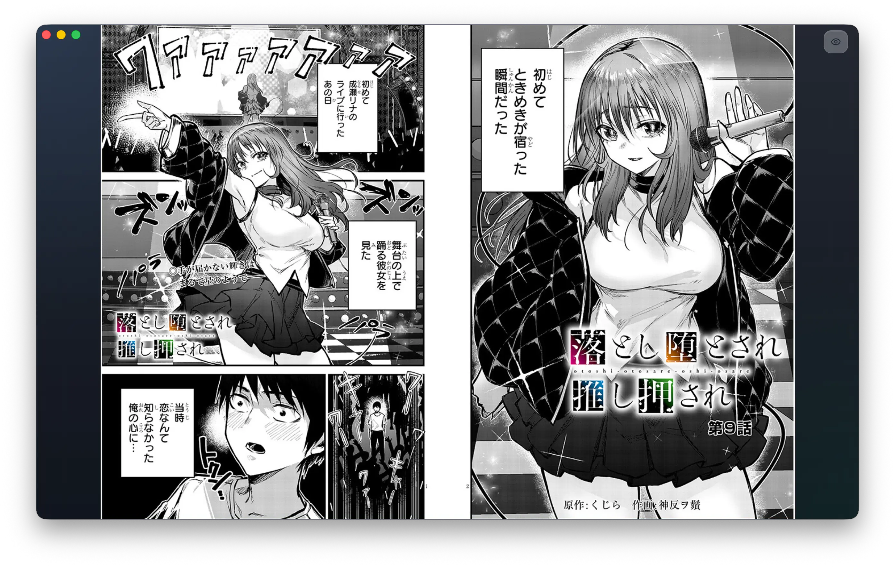

# PanelNeko Reader
[中文版](./README.zh-CN.md)
---------------------

PanelNeko Reader is a simple, lightweight, cross-platform desktop application designed exclusively for reading local manga, comics, and artbooks. It focuses on providing a pure, minimalist, and ad-free offline reading experience. Built with Go, Wails v2, and React, it provides a premium, high-performance offline reading experience with modern design aesthetics.



## Features

- **Integrated Reader**: 
  - **Scroll Mode**: Continuous vertical reading (webtoon style) with smart pre-caching.
  - **Paged Mode**: Traditional page-by-page side-to-side reading.
  - Opens local chapter folders and chapter `.zip` / `.cbz` archives directly.
  - Remembers and auto-restores your reading progress for every book.
- **Local Library**: Scan your local manga collection automatically from a designated library folder. Manage progress state seamlessly with an embedded SQLite database.
- **Aesthetic design**: Modern glassmorphism UI with vibrant colors, dark mode support, and micro-animations.
- **Internationalization**: Full support for English, Simplified Chinese, and Japanese.

## Tech Stack

- **Backend**: [Go](https://go.dev/) + [Wails v2](https://wails.io/) (Desktop Framework)
- **Database**: [SQLite](https://www.sqlite.org/) (via `go-sqlite3`)
- **Frontend**: [React](https://reactjs.org/) + [TypeScript](https://www.typescriptlang.org/)
- **State Management**: [TanStack Query](https://tanstack.com/query/latest)
- **Styling**: [Tailwind CSS](https://tailwindcss.com/)
- **Build Tool**: [Vite](https://vitejs.dev/)

## Getting Started

### Prerequisites

- [Go](https://go.dev/doc/install) (1.21 or later)
- [Node.js](https://nodejs.org/) & [pnpm](https://pnpm.io/)
- [Wails CLI](https://wails.io/docs/gettingstarted/installation)

### Development

1. Clone the repository:
   ```bash
   git clone https://github.com/sakagamijun/panelneko-reader.git
   cd panelneko-reader
   ```

2. Run in development mode:
   ```bash
   wails dev
   ```

### Building for Production

To create a standalone executable for your operating system:

```bash
wails build
```
The binary will be located in the `build/bin` directory.

## Acknowledgements

- [Wails](https://wails.io/) for the amazing bridge between Go and Web technologies.
- [shadcn/ui](https://ui.shadcn.com/) for the inspiration and base components.
- All the open-source libraries that made this project possible.

## License

This project is licensed under the MIT License - see the [LICENSE](LICENSE) file for details.
